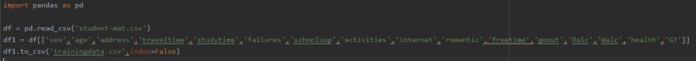
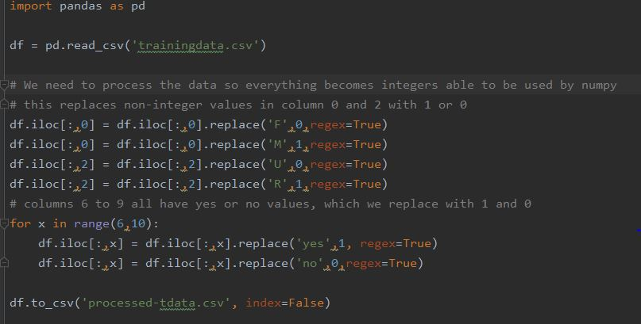

# Grade Prediction API

This site will serve as a techblog for the development of our grade prediction AI.

### Team ShallowMind members:

Cédric Chauvet, Department of Information Systems, Hanyang University 
Zachary Frank, Department of Computer Science, Hanyang University 
Emyl van der Kooi, Department of Nuclear Engineering, Hanyang University

## Introduction:
As students, we wanted to create something that was relevant to us that also made use of artificial intelligence. One of the most known websites among students is Rate My Professor. We wanted to create something similar; however, instead of using a professor rating to determine how well you would perform in a class, you can use our website to determine a grade based on factors such as study time per week, internet access, home location, and more. These predictions can  be used by students to advise them on how to excel and help universities advise and design a curriculum that accommodates their students.

In the end, we want to have a trained ai model, capable of producing accurate predictions based on the variables input into the ai. We want these predictions to be accessible through a web-service connected to a database. We also want functions for the continued training of the ai from user-input, such as transcripts and student results/variables. Our main model will be a neural network utilizing Keras. 

We will train two models, one using the complete dataset to achieve high accuracy, and one using the reduced dataset (detailed below) since the complete dataset doesn't fit our service (some variables are unavailable for our proposed users).

## Dataset:
The [dataset](https://www.kaggle.com/uciml/student-alcohol-consumption) being used to train the neural network to predict grades is a portugese survey-based grade dataset where grades and multiple variables are reported for 386 math students and 649 portugese-language students.

The dataset contains 33 different variable columns, detailed below. Not all of these are useful for our project though, since they cant be applied to higher education or outside of the dataset. The useful columns are in bold and the ones to be removed are in italics.  
*school - student's school (binary: 'GP' - Gabriel Pereira or 'MS' - Mousinho da Silveira) * 
**sex - student's sex (binary: 'F' - female or 'M' - male) 
age - student's age (numeric: from 15 to 22) 
address - student's home address type (binary: 'U' - urban or 'R' - rural) **
*famsize - family size (binary: 'LE3' - less or equal to 3 or 'GT3' - greater than 3)  
Pstatus - parent's cohabitation status (binary: 'T' - living together or 'A' - apart)  
Medu - mother's education (numeric: 0 - none, 1 - primary education (4th grade), 2 – 5th to 9th grade, 3 – secondary education or 4 – higher education)  
Fedu - father's education (numeric: 0 - none, 1 - primary education (4th grade), 2 – 5th to 9th grade, 3 – secondary education or 4 – higher education)  
Mjob - mother's job (nominal: 'teacher', 'health' care related, civil 'services' (e.g. administrative or police), 'at_home' or 'other')  
Fjob - father's job (nominal: 'teacher', 'health' care related, civil 'services' (e.g. administrative or police), 'at_home' or 'other')  
reason - reason to choose this school (nominal: close to 'home', school 'reputation', 'course' preference or 'other')  
guardian - student's guardian (nominal: 'mother', 'father' or 'other') *
**traveltime - home to school travel time (numeric: 1 - <15 min., 2 - 15 to 30 min., 3 - 30 min. to 1 hour, or 4 - >1 hour)  
studytime - weekly study time (numeric: 1 - <2 hours, 2 - 2 to 5 hours, 3 - 5 to 10 hours, or 4 - >10 hours)  
failures - number of past class failures (numeric: n if 1<=n<3, else 4)  
schoolsup - extra educational support (binary: yes or no) **
*famsup - family educational support (binary: yes or no)  
paid - extra paid classes within the course subject (Math or Portuguese) (binary: yes or no) *
**activities - extra-curricular activities (binary: yes or no) ** 
*nursery - attended nursery school (binary: yes or no)  
higher - wants to take higher education (binary: yes or no) * 
**internet - Internet access at home (binary: yes or no)  
romantic - with a romantic relationship (binary: yes or no) ** 
*famrel - quality of family relationships (numeric: from 1 - very bad to 5 - excellent) *
**freetime - free time after school (numeric: from 1 - very low to 5 - very high)  
goout - going out with friends (numeric: from 1 - very low to 5 - very high)  
Dalc - workday alcohol consumption (numeric: from 1 - very low to 5 - very high)  
Walc - weekend alcohol consumption (numeric: from 1 - very low to 5 - very high)  
health - current health status (numeric: from 1 - very bad to 5 - very good) ** 
*absences - number of school absences (numeric: from 0 to 93) 
G1 - first period grade (numeric: from 0 to 20)
G2 - second period grade (numeric: from 0 to 20)*
**G3 - final grade (numeric: from 0 to 20, output target)**

To be able to use this dataset with our neural network we have to do two things; Remove unnecessary columns, and replace non-integer values with binary integer values. 

To be left with the useful columns, we run this code:

To replace non-integer values with integer values, we run this:

These two together leaves us with a 'processed-tdata.csv' file that we can load with numpy!

## Methodology:

## Evaluation and Analysis:

## Related Work:
The dataset we are using for this project is attached to the research paper [*"Using Data Mining to Predict Secondary School Student Performance"*](https://repositorium.sdum.uminho.pt/handle/1822/8024) , where researchers used data from secondary school students in Portugal to learn what factors affect students’ performance.
They applied different types of ai models, such as Neural Nets, Decision Trees and Random Forests and compared their accuracy and error rate with different output (pass/fail, A-F,0-20). Their neural net was the worst performing model, but managed to score a 90.7% and 65.1% accuracy for the first two outputs, and a root mean square error of 1.36 for the regression output.

This project makes use of multiple frameworks and libraries. For the AI-portion of the project we are using Keras/Tensorflor/Numpy as our required backbone and Pandas/Pyplot for our data processing and analyzing. For the non-ai portion we make use of the Django Framework for building our web-service and MySQL for the database. 

To get an initial grasp on our dataset and it's variables, we read this [kaggle-blog](https://www.kaggle.com/dipam7/introduction-to-eda-and-machine-learning)
Do note that this blog is about the math course, while we base our solution on the portugese one since it is the bigger dataset. 

We made heavy use of the keras documentation, accessible at https://keras.io/, and tech blogs such as Medium to research how to build an optimal neural network- This included reading up about loss-functions, optimizers, etc. 
## Conclusion:

