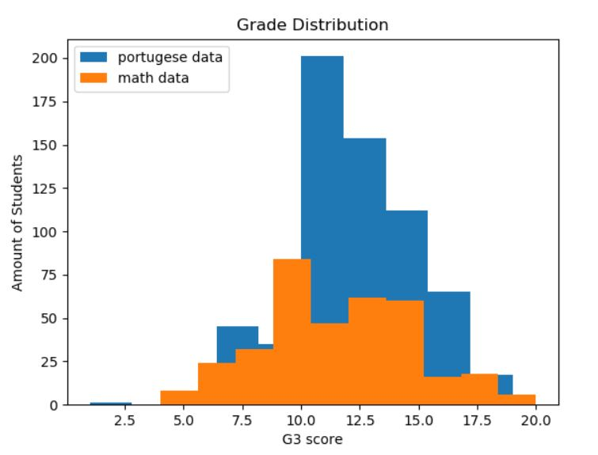
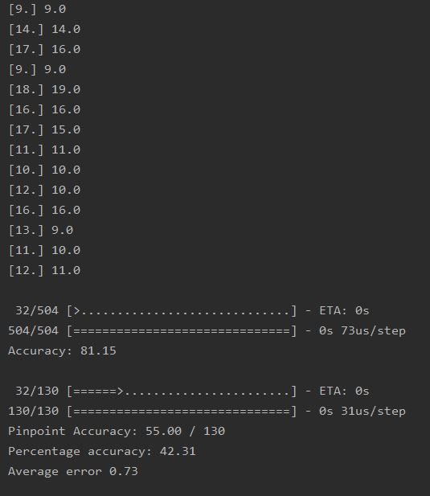

# Grade Prediction AI

This site will serve as a techblog for the development of our grade prediction AI.


### Team ShallowMind members:

Cédric Chauvet, Department of Information Systems, Hanyang University<br/>
Zachary Frank, Department of Computer Science, Hanyang University<br/>
Emyl van der Kooi, Department of Nuclear Engineering, Hanyang University

### Table of Contents
- [Introduction](https://cedchauv.github.io/Grade-Prediction-API/#introduction)
- [Related Work](https://cedchauv.github.io/Grade-Prediction-API/#related-work)
- [Dataset](https://cedchauv.github.io/Grade-Prediction-API/#dataset)
- [Methodology](https://cedchauv.github.io/Grade-Prediction-API/#methodology)
- [Evaluation and Analysis](https://cedchauv.github.io/Grade-Prediction-API/#evaluation-and-analysis)
- [Conclusion](https://cedchauv.github.io/Grade-Prediction-API/#conclusion)

## Introduction:
As students, we wanted to create something that was relevant to us that also made use of artificial intelligence. One of the most known websites among students is Rate My Professor. We wanted to create something similar; however, instead of using a professor rating to determine how well you would perform in a class, you can use our website to determine a grade based on factors such as study time per week, internet access, home location, and more. These predictions can  be used by students to advise them on how to excel and help universities advise and design a curriculum that accommodates their students.

In the end we want to have a trained ai model, capable of producing accurate predictions based on the variables input into the ai. We want these predictions to be accessible through a web-service connected to a database. We also want functions for the continued training of the ai from user-input, such as transcripts and student results/variables. Our main model will be a neural network utilizing Keras. 

We will train two models, one using the complete dataset to achieve high accuracy, and one using the reduced dataset (detailed below) since the complete dataset doesn't fit our service (some variables are unavailable for our proposed users).

## Related Work:
The dataset we are using for this project is attached to the research paper [*"Using Data Mining to Predict Secondary School Student Performance"*](https://repositorium.sdum.uminho.pt/handle/1822/8024) , where researchers used data from secondary school students in Portugal to learn what factors affect students’ performance.
They applied different types of ai models, such as Neural Nets, Decision Trees and Random Forests and compared their accuracy and error rate with different output (pass/fail, A-F,0-20). Their neural net was the worst performing model but managed to score a 90.7% and 65.1% accuracy for the first two outputs, and a root mean square error of 1.36 for the regression output, which gives us some metrics to compare to.

This project makes use of multiple frameworks and libraries. We are using Keras/Tensorflow/Numpy as our required backbone and Pandas/Matplotlib/Pyplot/Seaborn for our data processing and analyzing. 

To get an initial grasp on our dataset and it's variables, we read this [kaggle-blog](https://www.kaggle.com/dipam7/introduction-to-eda-and-machine-learning).
Do note that this blog is about the math course, while we base our solution on the portuguese one since it is the bigger dataset. 

We made heavy use of the keras documentation, accessible [here](https://keras.io), and tech blogs such as Medium to research how to build an optimal neural network- This included reading up about loss-functions, optimizers, etc.

## Dataset:
The [dataset](https://www.kaggle.com/uciml/student-alcohol-consumption) being used to train the neural network to predict grades is a Portuguese survey-based grade dataset where grades and multiple variables are reported for 386 math students and 649 portuguese-language students.

The dataset contains 33 different variable columns, detailed below. Not all of these are useful for our software engineering project though, since they cant be applied to higher education or outside of the dataset. The useful columns are in bold and the ones to be removed for the side project are in italics.<br/> 
*school - student's school (binary: 'GP' - Gabriel Pereira or 'MS' - Mousinho da Silveira)<br/>* 
**sex - student's sex (binary: 'F' - female or 'M' - male)<br/>
age - student's age (numeric: from 15 to 22)<br/>
address - student's home address type (binary: 'U' - urban or 'R' - rural)<br/>**
*famsize - family size (binary: 'LE3' - less or equal to 3 or 'GT3' - greater than 3)<br/> 
Pstatus - parent's cohabitation status (binary: 'T' - living together or 'A' - apart)<br/> 
Medu - mother's education (numeric: 0 - none, 1 - primary education (4th grade), 2 – 5th to 9th grade, 3 – secondary education or 4 – higher education)<br/> 
Fedu - father's education (numeric: 0 - none, 1 - primary education (4th grade), 2 – 5th to 9th grade, 3 – secondary education or 4 – higher education)<br/> 
Mjob - mother's job (nominal: 'teacher', 'health' care related, civil 'services' (e.g. administrative or police), 'at_home' or 'other')<br/> 
Fjob - father's job (nominal: 'teacher', 'health' care related, civil 'services' (e.g. administrative or police), 'at_home' or 'other')<br/> 
reason - reason to choose this school (nominal: close to 'home', school 'reputation', 'course' preference or 'other')<br/> 
guardian - student's guardian (nominal: 'mother', 'father' or 'other')<br/>*
**traveltime - home to school travel time (numeric: 1 - <15 min., 2 - 15 to 30 min., 3 - 30 min. to 1 hour, or 4 - >1 hour)<br/> 
studytime - weekly study time (numeric: 1 - <2 hours, 2 - 2 to 5 hours, 3 - 5 to 10 hours, or 4 - >10 hours)<br/> 
failures - number of past class failures (numeric: n if 1<=n<3, else 4)<br/> 
schoolsup - extra educational support (binary: yes or no)<br/>**
*famsup - family educational support (binary: yes or no)<br/> 
paid - extra paid classes within the course subject (Math or Portuguese) (binary: yes or no)<br/>*
**activities - extra-curricular activities (binary: yes or no)<br/>** 
*nursery - attended nursery school (binary: yes or no)<br/> 
higher - wants to take higher education (binary: yes or no)<br/>* 
**internet - Internet access at home (binary: yes or no)<br/> 
romantic - with a romantic relationship (binary: yes or no)<br/>** 
*famrel - quality of family relationships (numeric: from 1 - very bad to 5 - excellent)<br/>*
**freetime - free time after school (numeric: from 1 - very low to 5 - very high)<br/> 
goout - going out with friends (numeric: from 1 - very low to 5 - very high)<br/> 
Dalc - workday alcohol consumption (numeric: from 1 - very low to 5 - very high)<br/> 
Walc - weekend alcohol consumption (numeric: from 1 - very low to 5 - very high)<br/> 
health - current health status (numeric: from 1 - very bad to 5 - very good)<br/>** 
*absences - number of school absences (numeric: from 0 to 93)<br/>
G1 - first period grade (numeric: from 0 to 20)<br/>
G2 - second period grade (numeric: from 0 to 20)*<br/>
**G3 - final grade (numeric: from 0 to 20, output target)**

To be able to use this dataset with our neural network we have to replace non-integer values with binary integer values. So called label encoding. We achieve this with the help of pandas replace (example for complete dataset):
```python
import pandas as pd

df = pd.read_csv('./csv/student-por.csv')
df.iloc[:,0] = df.iloc[:,0].replace('GP',0, regex=True)
df.iloc[:,0] = df.iloc[:,0].replace('MS',1, regex=True)
df.iloc[:,1] = df.iloc[:,1].replace('F',0,regex=True)
df.iloc[:,1] = df.iloc[:,1].replace('M',1,regex=True)
df.iloc[:,3] = df.iloc[:,3].replace('U',0,regex=True)
df.iloc[:,3] = df.iloc[:,3].replace('R',1,regex=True)
df.iloc[:,4] = df.iloc[:,4].replace('GT3',1, regex=True)
df.iloc[:,4] = df.iloc[:,4].replace('LE3',0, regex=True)
df.iloc[:,5] = df.iloc[:,5].replace('A',1, regex=True)
df.iloc[:,5] = df.iloc[:,5].replace('T',0, regex=True)
df.iloc[:,8] = df.iloc[:,8].replace('at_home',0, regex=True)
df.iloc[:,8] = df.iloc[:,8].replace('health',1, regex=True)
df.iloc[:,8] = df.iloc[:,8].replace('other',2, regex=True)
df.iloc[:,8] = df.iloc[:,8].replace('services',3, regex=True)
df.iloc[:,8] = df.iloc[:,8].replace('teacher',4, regex=True)
df.iloc[:,9] = df.iloc[:,9].replace('at_home',0, regex=True)
df.iloc[:,9] = df.iloc[:,9].replace('health',1, regex=True)
df.iloc[:,9] = df.iloc[:,9].replace('other',2, regex=True)
df.iloc[:,9] = df.iloc[:,9].replace('services',3, regex=True)
df.iloc[:,9] = df.iloc[:,9].replace('teacher',4, regex=True)
df.iloc[:,10] = df.iloc[:,10].replace('home',0, regex=True)
df.iloc[:,10] = df.iloc[:,10].replace('course',1, regex=True)
df.iloc[:,10] = df.iloc[:,10].replace('reputation',2, regex=True)
df.iloc[:,10] = df.iloc[:,10].replace('other',3, regex=True)
df.iloc[:,11] = df.iloc[:,11].replace('mother',0, regex=True)
df.iloc[:,11] = df.iloc[:,11].replace('father',1, regex=True)
df.iloc[:,11] = df.iloc[:,11].replace('other',2, regex=True)
for x in range(15,23):
    df.iloc[:,x] = df.iloc[:,x].replace('yes',1, regex=True)
    df.iloc[:,x] = df.iloc[:,x].replace('no',0,regex=True)
```

To be left with the useful columns for the software engineering project, we also run this code:
```python
df1 = df[['sex','age','address','traveltime','studytime','failures','schoolsup','activities','internet','romantic',
'freetime','goout','Dalc','Walc','health','G3']]
```
While analyzing the dataset and after initial model training, we realized there were students scoring 0 for some unforeseen reason, considering they could have partial grades above a pass(10), we assume this is due to extraneous circumstances (i.e. missing a final exam, cheating) and as such we discard these as the model can't predict outside of its data.
```python
df = df[df.G3 != 0]
```
This leaves us with a processed dataset ready for use in our neural network!

We do this two times to create a reduced-dataset for math and portuguese that we use to train our webservice ai-model, and once to create a useable complete dataset file, where we don't run the code that removes columns.

Now it's time for some dataset analysis. First we want to check the grade distribution (after G3 = 0 has been removed).
```python
plt.hist(df['G3'], label='portugese data')
plt.hist(df2['G3'],label='math data')
plt.title('Grade Distribution')
plt.xlabel('G3 score')
plt.ylabel('Amount of Students')
plt.legend(loc='upper left')
plt.show()
```


Here we can both see how the portuguese dataset is bigger (almost double the size), but also how the math course has a lower grading average.

Next we take a look at the correlation between the variables, paying most attention to the correlation with G3 since that is the result we want to predict. 
```python
plt.figure(figsize=(10,8))
corr = abs(df3.corr())
sns.heatmap(corr, square=True)
plt.title('Correlation heatmap - Complete Dataset')
plt.show()
```


We can see that G1 and G2 have high correlation with each other and with G3, which is expected. We can also see an interesting, but ultimately irrelevant, correlation between parents' education level, and an expected correlation between weekday and weekend alcohol consumption. 
Since some values have a negative correlation (ex. failures), we will also take a look at an absolute heatmap to see which variables are strongest. 


Here we can see that outside of G1 and G2, failures, study time and whether they intend to pursue higher education had the highest impact on their grade, which makes perfect sense.

Finally, we check the correlation for the reduced dataset:


Here we see a slight problem for our prediction ability, since a lot of them aren't that impactful, and we lose some that had an impact, such as Mother's education (and G1/G2 of course). 


## Methodology:
To provide predictions we have chosen to use a deep neural network implemented with Keras. The neural network is trained and validated using the dataset detailed above. It is a regression problem where the AI needs to produce a grade prediction on the scale 0-20. We are using the ReLu activation function, since it's a proven great choice for most neural nets. The output layer does use a linear activation function however. We have tried both adam and rmsprop as optimizer functions and found adam to work best. For loss function we have tried: Mean absolute error, Mean Squared Error, Root Mean Squared Error and Mean Squared Logarithmic Error. We found the best result in using the mean squared error, probably because of its heavier penalization for larger errors.

We also experimented a lot with node amounts, layer amounts and epochs, but found it quite hard to dial it in perfectly or even see a noticeable difference when changing some values. The stochastic nature of neural networks didn't help, since rerunning the same code multiple times also gives different results. We struggled a bit with deciding when to be satisfied with our model as well, since you can continue tweaking it forever and the best theoretical result is unknown. 

To create our Keras model, we settled on these dimensions after a lot of testing:
```python
import numpy as np
from keras.models import Sequential
from keras.layers import Dense

dataset = np.loadtxt('./csv/complete-processed.csv', delimiter=',',skiprows=1)
split = 130
#15 reduced, 32 complete
variables = 32
x = dataset[:-split,0:variables]
y = dataset[:-split,variables]

model = Sequential()
model.add(Dense(25,input_dim = variables,kernel_initializer='normal', activation='relu'))
model.add(Dense(55,activation='relu'))
model.add(Dense(125,activation='relu'))
model.add(Dense(70,activation='relu'))
model.add(Dense(40,activation='relu'))
model.add(Dense(40,activation='relu'))
model.add(Dense(1, activation='linear'))
model.compile(loss='mean_squared_error',optimizer='adam',metrics=['accuracy'])
model.fit(x, y, epochs=400,batch_size=5)
model.save('predictormodelComplete.h5')
```
As mentioned above, we make use of mean squared error as loss function and adam as our optimizer. ReLu is used as an activation function for all layers except the final output one. We found that a batch size of 5 was a good tradeoff in training speed/accuracy and that epochs of ~400-450 worked fine to prevent overfitting with the complete and larger dataset. We make use of the 'variables' variable due to the shifting amounts of input depending on if we fit our complete or reduced dataset. 

The split variable is used to split the dataset into training and testing/validation data. Split is used over keras `validation_split=0.xx` so we can see the average error (how far off the guesses are). We test our model through this code:
```python
# training data accuracy
_, accuracy = model.evaluate(x, y)
print('Accuracy: %.2f' % (accuracy*100))

a = dataset[-split:,0:variables]
b = dataset[-split:,variables]

predictions = model.predict(a)
error = 0
for i in range(len(predictions)):
    print(predictions[i].round(), dataset[-(split-i), variables])
    error += abs(predictions[i].round() - dataset[-(split-i),variables])

error = error / split

_, accuracy = model.evaluate(a, b)
print('Pinpoint Accuracy: %.2f' % (accuracy*split), '/', split)
print('Percentage accuracy: %.2f' % (accuracy*100))
print("Average error %.2f" % error)
```
The predictions are made on the data saved through the earlier mentioned split variable. On our predictions we check how many we got exactly right and what percentage they make up, as well as the average error (calculated in the for loop and the directly following statement). This gives us an idea of how our model is performing. 
## Evaluation and Analysis:
To evaluate our neural net models we used multiple metrics, such as accuracy, average error and loss when predicting on the test data. 
Some statistics are shown below. The highest accuracy we achieved on our test set of ~120 with the complete dataset (all columns) was around ~47%. While with the reduced dataset we achieved a high of ~18%. It is unclear what the potential highest accuracy is, and how close we are to reaching it / how well our model actually is performing considering the data is has to work with. It is possible (maybe even probable) that the data just isn't enough to actually get a good prediction, especially considering the study only managed to get 90% when dealing with pass/fail(10+ G3 being pass).
Here is an example of a run instance:


We can see that the training accuracy is at 81%, while the validation accuracy is roughly half at 42%, but that the average error is low at 0,7. In the top half of the picture we can see some of the predicted values on the left, and the actual values on the right. 
Here we plot an instance, with `validation_split=0.20`:
```python
plt.plot(history.history['accuracy'])
plt.plot(history.history['val_accuracy'])
plt.title('Model accuracy')
plt.ylabel('Accuracy')
plt.xlabel('Epoch')
plt.legend(['Train', 'Test'], loc='upper left')
plt.show()
```


This graph shows the accuracy on training and validation data as it's being trained. We can see that while accuracy for testing doesn't reach higher after the initial bump, it does become more stable while not decreasing, which we see as an improvement, even if it might be the start of overfitting. 

The study mentioned in the beginning achieved an accuracy of ~65% using the complete dataset, and ~34% without G1 and G2 (so more variables than our reduced data). This however was as a five-level classification (where 0-9,10-11,12-13,14-15, and 16-20 are grouped) prediction and not a straight regression one. They do not provide accuracy for regression, only loss (using another loss function than we are). But it still gives us some reference numbers and considering their numbers for an "easier" problem we feel that our regression accuracy isn't too bad. 
 
## Conclusion:
With this project we have built, trained and tested a neural network on a student dataset, with the intention of predicting grades. We've also analyzed the dataset and the model itself. We found that predicting grades without the partial grades was a lot harder (of course) but would be the more useful ai by far, since a grade prediction after most of the semester is not nearly as useful. For our Software Engineering project, a pre-course prediction was our goal, so we removed these and the accuracy heavily suffered. The correlation values also helped us build an advisor function for the SE project. 

In the end, we've learned the basics of neural networks and it's functions, predictions, and data analyzing/manipulation. Tuning the AI has been a challenge due to how complex a neural network really is, with parts not fully understood and the general feeling of inputting into a black box where "something" happens - and hoping it matches up. We've also gotten an understanding of the challenges with data(For example, our dataset is lacking when it comes to predictions without G1 and G2), and the intense computational load(and time) training a neural net involves.


